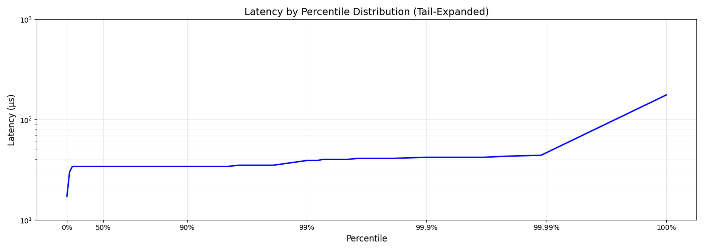
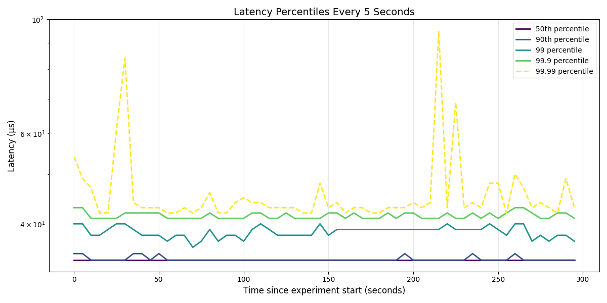
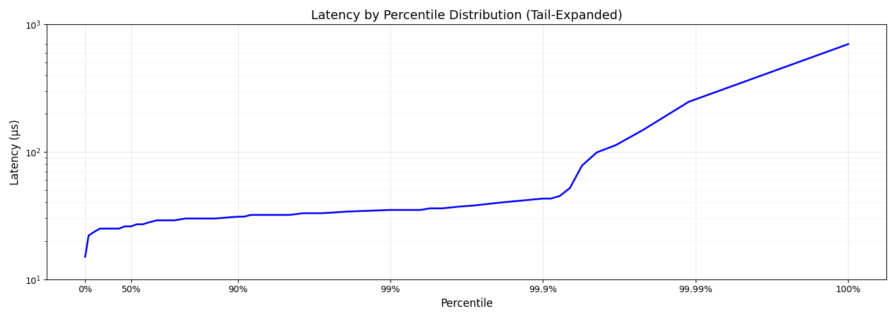
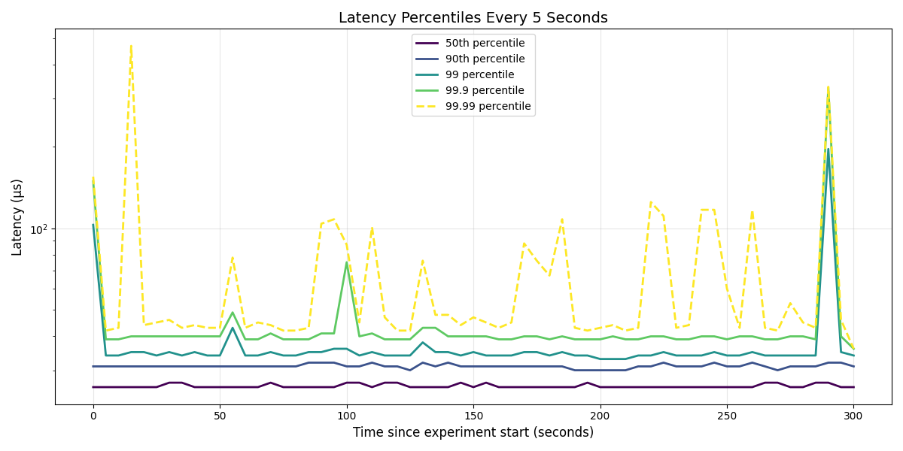

## Design

Amazon setup details:

- c5d.4xlarge
- 16 vCpus
- 32 GB RAM
- Ember ansible configurations (https://github.com/epam/ember-ami-builder) run on setup.

**KDB-X preview uses at most 16 Gb memory because of imposed limitations**

## Instruction

### Prerequisites
- Python 3.9 for charts (`python` alias)
    - Run `python -m venv venv` inside py-src directory
    - `source venv/bin/activate`
    - `pip install -r requirements.txt`
- KDB-X installed (`q` alias)

Experiments are controlled by `THROUGHPUT` and `DURATION` env variables.

### Suite
- run `suite.sh`

### Semi-Manual
- run `run.sh`

### Manual
- `cd q-src`
- Adjust `common.q`
- Run `q tick.q trades [logs] -t 0` (`logs` makes sure it keeps WAL)
- Run `q logger.q -p 5001`
- Run `q sub.q`
- Run `q latency.q`
- Wait for completion. Results will be visible in `logger`'s process as well as `results'.txt` file. All latencies for individual requests will be stored in `times.csv` file.
- Optional:
    - `cd py-src`
    - run `draw.py`
    - It will produce `results` folder with histograms of experiment based on `times.csv` file

## Results

Default settings are:
- No WAL
- Unix sockets enabled
- No affinity for processes

All latency values are reported in microseconds.

| Throughput (trades/s) | P50 (µs) | P90 (µs) | P99 (µs) | P99.9 (µs) | P99.99 (µs) |
|----------------------:|---------:|---------:|---------:|-----------:|------------:|
|                 10000 |       34 |       35 |       38 |         38 |          45 |
|                 20000 |       34 |       39 |       42 |         47 |          54 |
|                 40000 |       34 |       35 |       39 |         42 |          45 |
|                 60000 |       27 |       32 |       35 |         43 |         262 |
|                 80000 |        - |        - |        - |          - |    overflow |

## Detailed results

**40K req/s**

**60K req/s**

