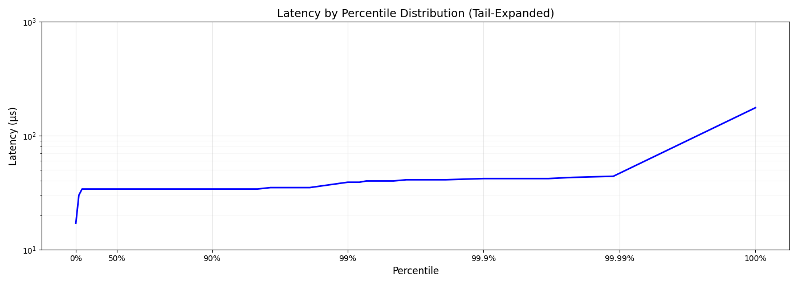
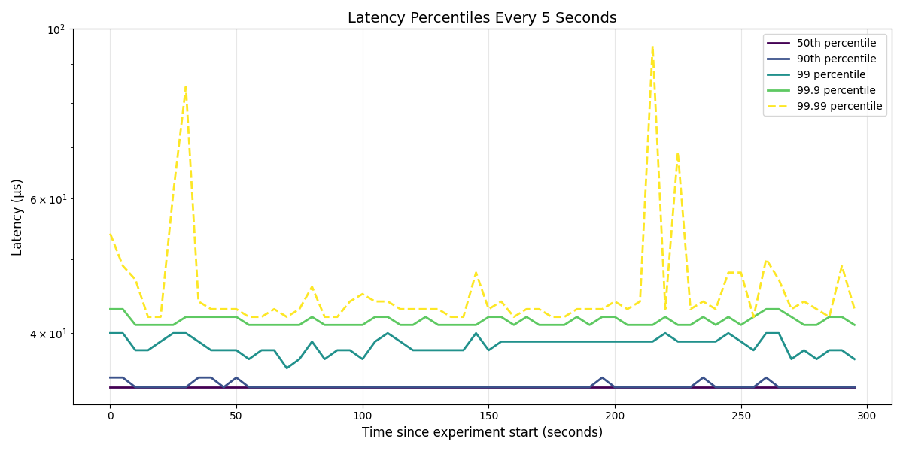
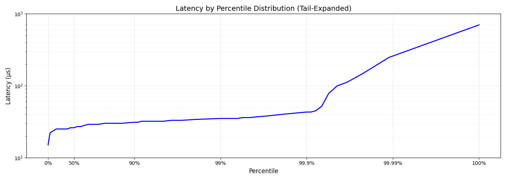
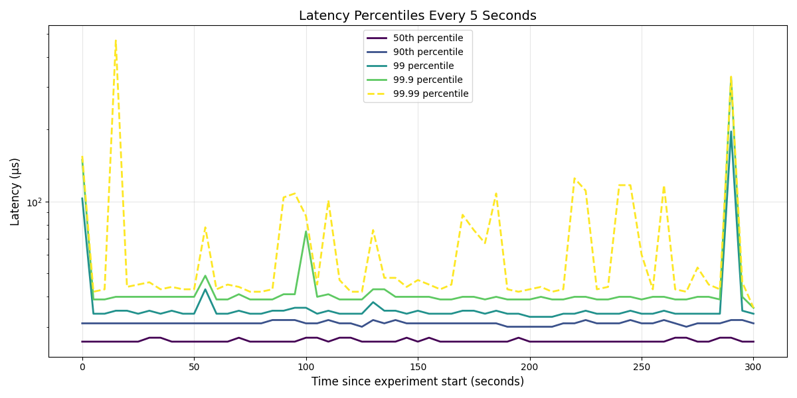
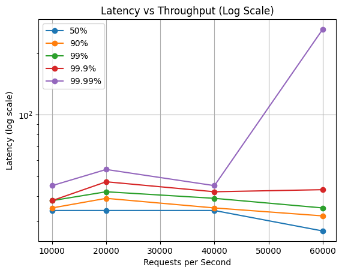
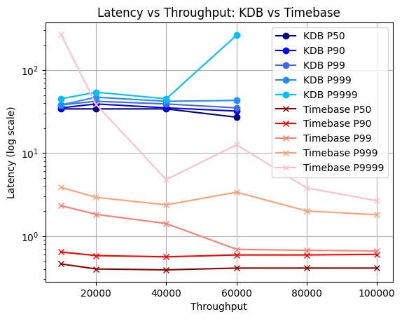

## Design

The experiment is measuring latency between producer and consumer on same physical machine for small, irregular in time messages - trades in this example. This could be applicable in designing tick-to-trade applications and strategies requiring immediate feedback on new observed trade.

We are using KDB architecture recommended by official documentation with publisher, tickerplant and subscriber with addition of separate logger for measuring experiment performance as it was found benefitial to separate this process from the main one.

### Details

Experiment is designed to be as simple as possible.
- Publisher is submitting randomly created messages while maintaining the desired throughput with busy-waiting between subsequent messages scheduled send time.
- Ticker plant is unaltered tick.q from official KDB documentation used without write ahead log for maximum performance.
- Subscriber is responsible only for calculating difference between message original time and current time and asynchronously submitting this difference to logger.
- Logger is maintaining histogram of latencies.

### Setup

Amazon setup details:

- c5d.4xlarge
- 16 vCpus
- 32 GB RAM
- Ember ansible configurations (https://github.com/epam/ember-ami-builder) run on setup.

**KDB-X preview uses at most 16 Gb memory because of imposed limitations**

## Instruction

### Prerequisites
- Python 3.9 for charts (`python` alias)
    - Run `python -m venv venv` inside py-src directory
    - `source venv/bin/activate`
    - `pip install -r requirements.txt`
- KDB-X installed (`q` alias)

Experiments are controlled by `THROUGHPUT` and `DURATION` env variables.

### Suite
- run `suite.sh`

### Semi-Manual
- run `run.sh`

### Manual
- `cd q-src`
- Adjust `common.q`
- Run `q tick.q trades [logs] -t 0` (`logs` makes sure it keeps WAL)
- Run `q logger.q -p 5001`
- Run `q sub.q`
- Run `q latency.q`
- Wait for completion. Results will be visible in `logger`'s process as well as `results'.txt` file. All latencies for individual requests will be stored in `times.csv` file.
- Optional:
    - `cd py-src`
    - run `draw.py`
    - It will produce `results` folder with histograms of experiment based on `times.csv` file

## Results

Default settings are:
- No WAL
- Unix sockets enabled
- No affinity for processes

All latency values are reported in microseconds.

| Throughput (trades/s) | P50 (µs) | P90 (µs) | P99 (µs) | P99.9 (µs) | P99.99 (µs) |
|----------------------:|---------:|---------:|---------:|-----------:|------------:|
|                 10000 |       34 |       35 |       38 |         38 |          45 |
|                 20000 |       34 |       39 |       42 |         47 |          54 |
|                 40000 |       34 |       35 |       39 |         42 |          45 |
|                 60000 |       27 |       32 |       35 |         43 |         262 |
|                 80000 |        - |        - |        - |          - |    overflow |

## Detailed results

**40K req/s**

**60K req/s**

## Results

**We find that KDB processes in the experiment overflow on 80 000 msg/second suggesting that this throughput is bound for adequate latencies, while exhibiting fairly uniform latencies of 30-40 microseconds for any throughput lower than 80 000**.

KDB official documentation suggests much higher possible throughput of several millions messages per second, however this is achieved by explicit or implicit batching, which is unapplicable for the scenario investigated here (minimum latency tick-to-trade or similar applications).

### Timebase comparison

Detailed experiment against timebase could be found here: [TBD]

 In the scenario of pure message broker, KDB seems inferior to other applications such as Timebase, which results are included below:

| Throughput (msg/s) | P50(us) | P90(us) | P99(us) | P999(us) | P9999(us) |
|--------------------|---------|---------|---------|----------|-----------|
| 10000              | 0.46    | 0.64    | 2.32    | 3.85     | 269.57    |
| 20000              | 0.40    | 0.58    | 1.82    | 2.92     | 38.37     |
| 40000              | 0.39    | 0.56    | 1.41    | 2.37     | 4.77      |
| 60000              | 0.41    | 0.59    | 0.69    | 3.37     | 12.58     |
| 80000              | 0.41    | 0.59    | 0.67    | 2.00     | 3.80      |
| 100000             | 0.41    | 0.60    | 0.66    | 1.80     | 2.66      |

**Timebase exhibits uniform latencies in single-digit microseconds up to 100 000 messages/second.**

